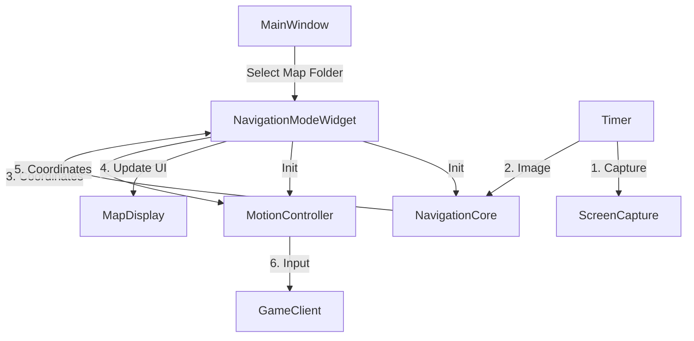

# 地图自动导航 MVP 开发计划

本计划旨在实现最小可行性产品 (MVP)，即在已有的静态地图上定位玩家位置，并通过点击大地图控制玩家移动到目标点。

## 1. 总体架构设计

为了保持代码的清晰和低耦合，我们将功能模块化拆分。

*   **数据层 (Core)**: 负责地图数据的加载、保存的坐标管理、以及核心的图像识别定位算法。
*   **控制层 (Controller)**: 负责将计算出的路径或方向转换为实际的游戏输入（鼠标点击或键盘按键）。
*   **表现层 (GUI)**: 负责显示地图、绘制玩家位置、接收用户点击的目标点，并调度 Core 和 Controller。

## 2. 新增与修改文件清单

### A. 新增文件

1.  **`core/navigation_core.py`** (导航核心)
    *   **职责**:
        *   加载 `map_data.npz` (墙壁层, 迷雾层等)。
        *   提供 `localize(current_minimap_image)` 方法：接收实时小地图截图，在全局大地图中进行模板匹配，返回玩家当前坐标 (Global X, Y)。
        *   为了性能，实现“局部搜索”逻辑：只在上一次已知位置的周围 (e.g., ±200px) 进行搜索。
    
2.  **`core/motion_controller.py`** (运动控制)
    *   **职责**:
        *   接收当前坐标和目标坐标。
        *   计算移动向量。
        *   **MVP 实现**: 简单的鼠标点击移动或模拟 WASD。
        *   提供 `move_to(current_pos, target_pos)` 接口。

### B. 修改文件

1.  **`gui/navigation_mode.py`** (重写占位符)
    *   **职责**:
        *   初始化时接收 `map_data_path`。
        *   包含一个 `QGraphicsView` 或自定义 Widget 用于显示全局地图。
        *   **交互**: 监听鼠标点击事件，将点击的像素坐标转换为全局坐标作为 `target_pos`。
        *   **渲染**: 在地图上绘制“玩家位置(红点)”和“目标位置(绿旗)”。
        *   **循环**: 启动定时器 (Timer)，定期调用 `Capture` 获取截图 -> `NavigationCore` 定位 -> 更新 UI -> `MotionController` 移动。

2.  **`gui/improved_main_window.py`**
    *   **职责**:
        *   在切换到“导航模式”时，弹出文件选择框让用户选择地图文件夹。
        *   实例化 `NavigationModeWidget` 并传入选择的地图路径。
        *   管理模式切换的生命周期 (停止绘图定时器，启动导航定时器)。

## 3. 详细开发步骤

### 阶段一：核心定位 (Navigation Core)

**目标**: 加载地图并在控制台输出当前玩家坐标。

1.  创建 `core/navigation_core.py`。
2.  实现 `NavigationCore` 类。
    *   `__init__(self, map_folder)`: 读取 `.npz` 文件，恢复 `wall_layer` (用于匹配)。
    *   `update_position(self, minimap_img)`:
        *   处理输入的小地图 (Mask处理)。
        *   使用 `cv2.matchTemplate` 在 `wall_layer` 上寻找最佳匹配。
        *   **关键**: 首次全图搜索，后续局部搜索 (Local Search Window)。
        *   返回 `(x, y, confidence)`。

### 阶段二：交互式 UI (Navigation UI)

**目标**: 能够看到大地图，看到自己位置的红点在动，点击地图能设置目标点。

1.  编辑 `gui/navigation_mode.py`。
2.  实现地图显示逻辑：
    *   加载 `map_image.png` 到 `QPixmap`。
    *   使用 `QGraphicsScene` 管理地图图元、玩家点、目标点。
3.  实现点击交互：
    *   重写 `mousePressEvent`，记录点击坐标为 `self.target_pos`。
4.  集成定时器循环：
    *   每 100ms 截图 -> 调用 `NavigationCore.update_position` -> 更新 `QGraphicsItem` 的位置。

### 阶段三：真实移动 (Motion Control)

**目标**: 人物在游戏中实际移动。

1.  创建 `core/motion_controller.py`。
2.  实现简单的移动逻辑 (根据游戏类型选择):
    *   **方案 A (鼠标点击)**: 如果是类似暗黑/火炬之光，计算目标点在屏幕相对于中心的偏移，点击屏幕对应位置。
    *   **方案 B (WASD)**: 计算角度，按下对应方向键。
3.  在 `gui/navigation_mode.py` 的循环中调用 `MotionController`。

## 4. 模块依赖关系图

## 5. 预期交付物

一个包含完整功能的 `gui/navigation_mode.py` 和配套的 `core` 模块，用户加载之前保存的 `冰2-群山之心` 文件夹后，人物移动，UI上的红点同步移动；点击UI地图任意位置，人物自动向该方向移动。
